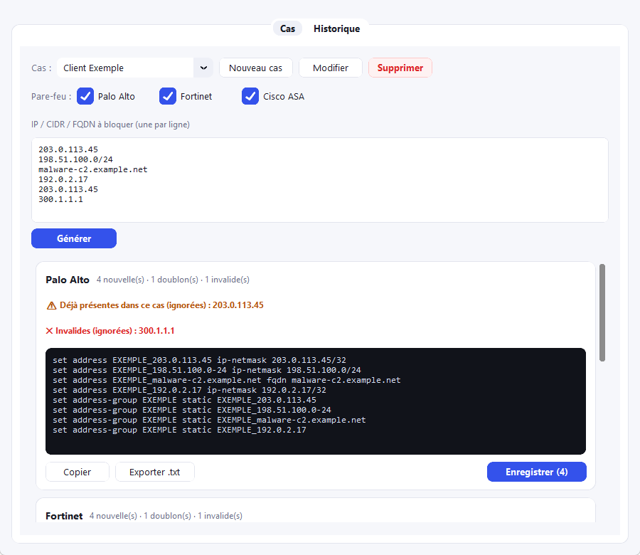
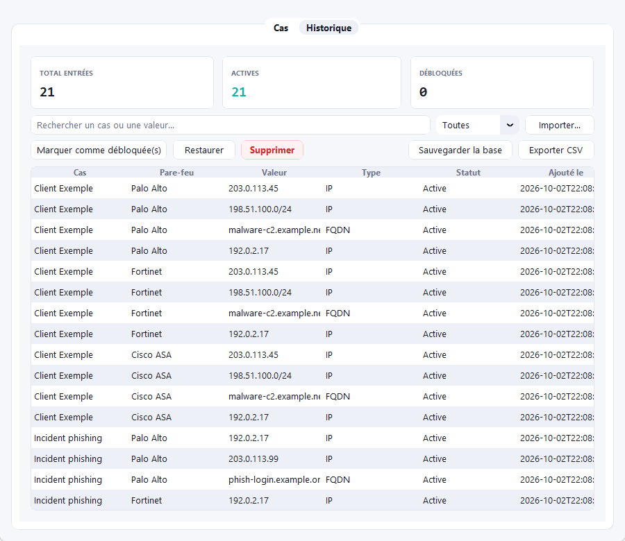

# Blacklister IP

[](LICENSE)

Application Windows portable pour générer les commandes CLI de blocage d'IP/FQDN sur Palo Alto, Fortinet et Cisco ASA, avec historique local et détection de doublons.

## À quoi ça sert

En réponse à incident, bloquer une IP malveillante veut souvent dire l'écrire à la main sur plusieurs pare-feu — chacun avec sa propre syntaxe (Palo Alto ≠ Fortinet ≠ Cisco ASA). C'est lent et source d'erreurs (CIDR mal formé, doublon entre deux cas...).

Blacklister IP automatise ça : on colle une liste d'IP/CIDR/FQDN, on coche les pare-feu cibles, l'appli génère les commandes prêtes à coller, valide les entrées et détecte les doublons. Les blocages sont organisés par **cas** (ex. un client ou un incident), avec un historique local consultable et exportable en CSV.

Portable (un `.exe` + un dossier `data/`), aucune installation requise.

## Aperçu

Captures réalisées sur des données fictives (adresses de documentation RFC 5737, domaines `example.*`).





## Utilisation (développement)

```bash
pip install -r requirements.txt
python app/main.py
```

1. Onglet **Cas** : créer ou sélectionner un cas (ex: "iTrust"), cocher les pare-feu cibles, coller une liste d'IP/CIDR/FQDN (une par ligne), cliquer **Générer**. Chaque cas définit un préfixe pour les objets réseau et, si besoin, un préfixe de groupe différent (par défaut identique au préfixe des objets).
2. Vérifier les commandes générées, les doublons (dans le cas ou dans un autre cas) et les valeurs invalides.
3. **Copier** ou **Exporter .txt** les commandes, puis **Enregistrer** pour les ajouter à l'historique du cas.
4. Onglet **Historique** : rechercher/filtrer toutes les entrées bloquées, exporter en CSV.

## Build de l'exécutable portable

```powershell
./build.ps1
```

Génère `dist/BlacklisterIP.exe`. Un dossier `data/` (base SQLite + `app.log`) est créé à côté de l'exe au premier lancement — copier l'exe + son dossier `data/` suffit à déplacer l'appli sur un autre poste, sans installation.

## Tests

```bash
pip install -r requirements-dev.txt
python -m pytest tests/
```

Couvre la validation (`validators.py`), la génération de commandes par pare-feu (`generators/`) et la logique de dédup/sauvegarde (`blocker.py`), avec une base SQLite temporaire isolée par test (`tests/conftest.py`).

## Logs

Toute exception non gérée (démarrage ou callback d'interface) est enregistrée dans `data/app.log` et affichée dans une boîte de dialogue — utile car l'exe est construit en mode `--windowed` (pas de console visible).

## Structure

- `app/validators.py` — validation/normalisation IPv4, CIDR, FQDN
- `app/db.py` — persistance SQLite (cas, entrées bloquées)
- `app/blocker.py` — dédup intra/inter-cas + orchestration des générateurs
- `app/generators/` — un module par marque de pare-feu
- `app/ui/` — interface CustomTkinter
- `app/logging_setup.py` — logging fichier + capture des exceptions non gérées
- `tests/` — suite de tests pytest
